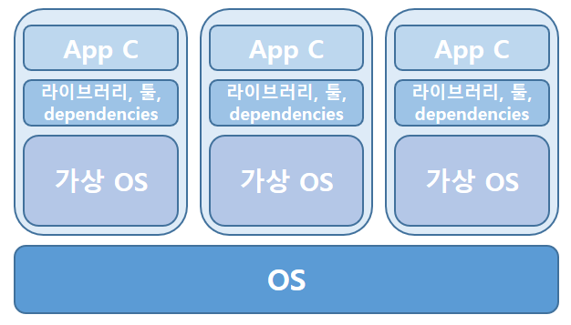
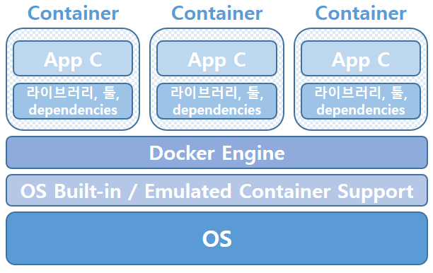

# Docker

## section #1

### 도커란 무엇인가?

> 도커는 컨테이너 기술로, 컨테이너를 생성하고 관리하기 위한 표준 도구이다

 

※ S/W에서 컨테이너란 무엇인가?

=> 표준화된 S/W 유닛

- 컨테이너 => 물건을 옮기는데 도움을 주는 도구; 표준화된 컨테이너가 있으면 그 곳에 있는 물건 들은 다른 곳과 섞이지 않음 해당 컨테이너만 옮기면 안의 물건들은 어디든 갈 수 있음

- 피크닉 바구니 => 접시, 음식이 담겨 있고, 친구와 피크닉 바구니를 공유 가능하고 어디에서든 안에 있는 내용물을 들고 이동해서 피크닉을 즐길 수 있음

 

### 컨테이너가 필요한 이유?

- 왜 컨테이너가 필요한가?
- 독립적인 표준화된 어플리케이션 패키지를 제공하는 이유?

#### 개발 환경 때문

동일한 개발 환경을 갖는다는 것은 굉장히 중요함. 어떤 곳에서는 해당 버전에 맞는 런타임 환경이 구축되어 있어서 바로 실행이 가능한 반면, 어떤 곳은 그렇지 못한 곳이 있음

큰 팀에는 동일한 프로젝트를 하지만 각 개개인의 개발 환경이 충분히 다를 수도 있음 => 만약 어떤 팀원이 프로그램 버전 업데이트를 한동안 안했다면 해당 팀원의 환경에서는 프로젝트가 구동되지 않을 수도 있음

혼자 작업하는 경우에도 유용; 작업하는 프로젝트가 여러 개일 경우 프로젝트의 사용 프로그램 버전 차이로 인해서 프로젝트 간 충돌 발생 가능성이 있음
=> 도커와 컨테이너의 개념을 적용하면 프로젝트 간 전환이 매우 쉬워짐. 각 환경(프로그램 버전 등)을 컨테이너별로 보관하고 각 프로젝트를 해당 컨테이너가 제공해주는 공간을 사용하게 함(각 프로젝트별로 개별 컨테이너를 가지게 함)

 

##### 컨테이너 안에 담긴 것들을 어디에서나 실행해도 항상 동일한 동작을 보장한다

##### 도커 컨테이너를 사용한다면 코드가 항상 정확한 버전으로 실행되도록 할 수 있음

##### 같은 코드 기반에서 함께 작업 가능, 항상 작동, 항상 같은 환경을 제공

 

### 가상 머신 VS 컨테이너

#### 의문점

"도커가 제공하는 기능을 가상 머신으로 해결하면 되는 거 아닌가??" => "Maybe"

 

#### 가상 머신(Virtual Machine)

가상 머신을 통해서 독립된 공간을 만들고 생산 가능함, 재생산 및 공유 가능

VM은 OS위에 설치하는 것임 따라서 해당 VM 안에 설치한 OS에 맞는 VM OS가 존재함

그러나 이는 문제가 있음. 어찌 됐든 VM은 OS 위에 설치되어있고 그 수가 다수라면 우리 OS의 자원(메모리, CPU)과 저장공간 등을 낭비하게 됨 => 점점 많아지면 많아질수록 OS의 오버헤드가 발생할 수 밖에 없음

또한, 매번 VM을 설치할 때마다 설정을 해줘야하며, 해당 설정을 직접 해야하기 때문에 100% 동일한 VM 환경이라고 볼 수 없음

개발에서 제품 생산으로 어플리케이션을 배포하려면 해당 프로젝트를 작업했던 VM 환경과 동일한 방식, 환경의 프로덕션 머신을 구성해야한다는 단점 존재

 

#### 컨테이너(Container)

하나의 OS 위에 해당 OS가 기본적으로 내재하고 있거나 컨테이너 에뮬레이터를 지원하는 내장 컨테이너를 사용하여 도커 엔진이 컨테이너를 구축함

컨테이너는 VM과 달리 OS에 미치는 영향이 적고, 속도도 빠르고, 용량이 작음, 공유 가능(배포 및 재구축이 쉬움), 앱과 앱의 실행에 필요한 것들만 캡슐화할 수 있음

반면, VM은 OS에 많은 영향을 끼치고, 상대적으로 느리고, 많은 공간을 차지함, 공유/재구축이 컨테이너에 비해 힘듦. 환경을 캡슐화하긴 하지만 앱과 앱 실행에 필요한 것들 뿐만 아니라 컴퓨터 전체를 캡슐화하는 개념임

=> 컨테이너의 최대 장점은 동일한 환경을 다른 사람과 공유 가능하다는 점

 

#### ※ 도커 설치

리눅스는 도커 엔진을 기본적으로 지원함. 따라서 사실상 별도로 설치할 필요가 없음

그러나 윈도우나, MacOS의 경우 Docker Desktop을 설치해야 Docker를 사용 가능함

WSL2는 윈도우 내부에 리눅스를 설치하는 개념이라고 이해하는 것이 편함

 

### 명령어

- `docker build .` : 현재 도커 파일 내용을 토대로 이미지를 빌드함
- `docker run <이미지 ID>` : 빌드한 이미지를 연결/실행함 => 실행하면 마치 서버가 켜진 상태라고 보는 것이 편함
  - `docker run -p 3000:80 <이미지 ID>` : 이미지를  3000번 포트에 publish하여 실행함
    - 3000 : 로컬 포트 / 80 : 내부 도커 컨테이너 노출 포트(EXPOSE를 통해 지정한 포트)
- `docker ps` : 현재 실행 중인 컨테이너 리스트를 출력함 ※ 이미지를 실행 중이라면 새로운 터미널에서 입력
  - `docker ps -a` : ps는 프로세스, -a는 all의 의미

- `docker stop <컨테이너 이름>` : 컨테이너를 중지함 ※ 시간이 조금 걸릴 수도 있음
- `docker run -it <이미지/런타임 명>` : 예) docker run -it node => 컨테이너 내부에서 node.js 환경을 실행

 

## section #2

### 이미지와 컨테이너

#### 컨테이너

Unit of S/W

 

#### 이미지

컨테이너의 설계도/템플릿 + 코드/필요 툴 및 환경 => 공유 가능한 패키지의 개념

##### ☆★ 컨테이너는 이미지의 구체적인 실행 인스턴스(이미지 기반의 컨테이너) ★☆

build 명령어를 통해 이미지를 만들고, run 명령어를 통해 이미지의 인스턴스인 컨테이너를 만듦

(흔히 run <이미지명> 명령어를 보고 이미지를 실행한다고 착각하기 쉽지만, 실행하는 것은 이미지가 아니라 이미지를 기반으로 하는 컨테이너를 실행하는 것임)

※ 이미지에서 명시한 실행환경이 없더라도 도커 허브에서 해당 실행환경 이미지를 불러와서 이미지를 커스텀하는 것이 가능함

